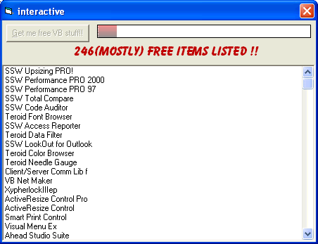



## Hundreds of FREE activex controls and VB related compenents with this download

### Description

This is an application I put together that goes on the web and downloads and lists the links to thousands of vb related software and more. Not all the items are free but enouph are that you ll be busy "unwrapping" your new christmas presents for weeks to come!!
 
### More Info
 

             |
---                |---
**Submitted On**   |2005-01-23 04:14:14
**By**             |[Evan Toder](https://github.com/Planet-Source-Code/PSCIndex/blob/master/ByAuthor/evan-toder.md)
**Level**          |Intermediate
**User Rating**    |5.0 (10 globes from 2 users)
**Compatibility**  |VB 3\.0, VB 4\.0 \(16\-bit\), VB 5\.0, VB 6\.0
**Category**       |[Complete Applications](https://github.com/Planet-Source-Code/PSCIndex/blob/master/ByCategory/complete-applications__1-27.md)
**World**          |[Visual Basic](https://github.com/Planet-Source-Code/PSCIndex/blob/master/ByWorld/visual-basic.md)
**Archive File**   |[Hundreds\_o1843191232005\.zip](https://github.com/Planet-Source-Code/evan-toder-hundreds-of-free-activex-controls-and-vb-related-compenents-with-this-download__1-58450/archive/master.zip)

